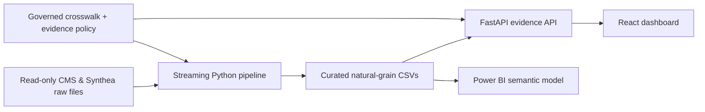

# Architecture

The pipeline is independent of hosting. Docker/Azure only run the already-built web/API layers. The scoring service reads curated outputs, never raw rows in the browser, and the assistant summarizes structured API evidence rather than calculating metrics.

The web application requires `npm install` followed by `npm run dev` or `npm run build`; JSX is compiled by Vite, not executed directly by Python.
