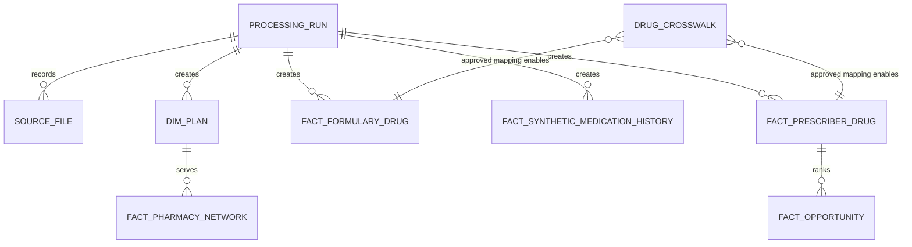

# Governed data model

The model treats Medicare CMS evidence and Synthea evidence as separate domains. A drug relationship becomes usable only through an approved row in `drug_crosswalk`; no name-similarity join is permitted.

## Join contract

| Relationship | Key | Rule |
|---|---|---|
| Prescriber drug → formulary drug | Approved `drug_crosswalk`, then RxCUI or NDC | Use only approved one-to-one/one-to-many mappings after multiplier review. |
| Plan → pharmacy network | Actual plan identifier in both sources | Validate year and cardinality. |
| Synthea medication → CMS evidence | None | Never join. An explicitly labelled demo scenario may display both, but cannot create a scored fact. |
| HLSum → detailed CMS utilization | None | Context-only; no physical join. |

## Scoring gates

`Cost_Score` and `Utilization_Score` use the CMS prescriber-drug fact. `Formulary_Score`, `Network_Score`, and `Generic_Score` must stay `NULL` until their mapping/relationship gates pass. `Adherence_Score` stays `NULL` unless a synthetic or real dispensing fact has validated fill dates and days supply. A final score must record its enabled components and mapping status.

The DDL is in [schema.sql](../models/schema.sql). Run the mapping validator with `python processing/mapping/validate_drug_crosswalk.py` after adding reviewed source data to a copy of the template.
